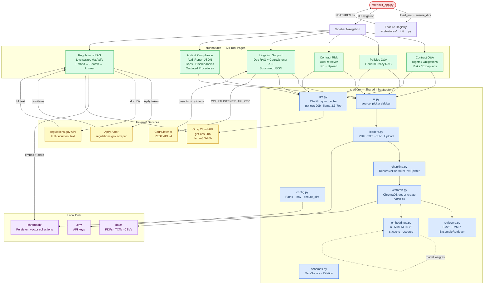

# Legal AI Hub

A production-ready, multi-feature AI legal assistant built with **Streamlit**, **LangChain**, **ChromaDB**, and **Groq**. It provides a unified, navigable UI for six distinct legal document analysis pipelines, all sharing a clean layered architecture.

---

## Table of Contents

1. [Features at a Glance](#features-at-a-glance)
2. [Project Structure](#project-structure)
3. [Setup & Installation](#setup--installation)
4. [File-by-File Deep Dive](#file-by-file-deep-dive)
   - [Entry Point](#1-entry-point--streamlit_apppy)
   - [Core Layer](#2-core-layer--srccore)
   - [Feature Registry](#3-feature-registry--srcfeatures__init__py)
   - [Contract Q&A](#4-feature--contract-qa)
   - [Policies Q&A](#5-feature--policies-qa)
   - [Contract Risk Analyzer](#6-feature--contract-risk-analyzer)
   - [Litigation Support](#7-feature--litigation-support)
   - [Audit & Compliance](#8-feature--audit--compliance)
   - [Regulations RAG](#9-feature--live-regulations-rag)
5. [RAG Pipeline: Step-by-Step](#rag-pipeline-step-by-step)
6. [Hybrid Retrieval Explained](#hybrid-retrieval-explained)
7. [LLM Strategy](#llm-strategy)
8. [Environment Variables](#environment-variables)
9. [Architectural Diagram](#architectural-diagram)

---

## Features at a Glance

| Feature | What it does | Document source | LLM output |
|---|---|---|---|
| **Contract Q&A** | Answers questions structured as Rights / Obligations / Risks / Exceptions | Local `.txt` files or upload | Free-text markdown |
| **Policies Q&A** | RAG over internal policy PDF documents | Local PDFs or upload | Free-text markdown |
| **Contract Risk Analyzer** | Cross-references uploaded contract against a curated risky-clause knowledge base | KB (PDF+CSV) + optional upload | Free-text markdown (5-section report) |
| **Litigation Support** | RAG over local case docs **and** live CourtListener case law search | Local PDFs + CourtListener API | Structured Pydantic JSON |
| **Audit & Compliance** | Automated audit report with gaps, discrepancies, outdated procedures, and ratings | Local PDFs or upload | Structured Pydantic JSON |
| **Live Regulations RAG** | Scrapes regulations.gov via Apify, embeds live content, answers in real-time | regulations.gov (live) | Free-text with source links |

---

## Project Structure

```
LegalAI/
├── streamlit_app.py              # App entry point — builds navigation from registry
├── requirements.txt              # All Python dependencies
├── .env                          # API keys (not committed)
│
├── src/
│   ├── __init__.py
│   │
│   ├── core/                     # Shared infrastructure — zero Streamlit imports
│   │   ├── config.py             # Path constants, .env loader, directory bootstrap
│   │   ├── embeddings.py         # HuggingFace embedding model singleton
│   │   ├── chunking.py           # RecursiveCharacterTextSplitter wrapper
│   │   ├── loaders.py            # PDF / TXT / CSV loaders + upload helper
│   │   ├── vectordb.py           # ChromaDB get-or-create with batch ingestion
│   │   ├── retrievers.py         # Hybrid BM25 + MMR EnsembleRetriever
│   │   ├── llm.py                # ChatGroq factory with lru_cache deduplication
│   │   ├── schemas.py            # DataSource dataclass + Citation Pydantic model
│   │   └── ui.py                 # source_picker() sidebar widget
│   │
│   └── features/
│       ├── __init__.py           # FeatureSpec dataclass + FEATURES registry
│       ├── contract_qna/
│       │   ├── pipeline.py       # RAG chain (no Streamlit)
│       │   └── page.py           # SPEC + render() function
│       ├── policies_qna/
│       │   ├── pipeline.py
│       │   └── page.py
│       ├── contract_risk/
│       │   ├── pipeline.py       # Dual-retriever chain (KB + optional upload)
│       │   └── page.py
│       ├── litigation/
│       │   ├── pipeline.py       # Document RAG + live CourtListener API chain
│       │   └── page.py
│       ├── audit_compliance/
│       │   ├── pipeline.py       # Structured AuditReport JSON chain
│       │   └── page.py
│       └── regulations_rag/
│           ├── pipeline.py       # Apify scrape → embed → ChromaDB → Groq chain
│           └── page.py
│
├── data/                         # Runtime document storage (gitignored)
│   ├── Contract_Renewal_QNA/
│   ├── Contract_Risk/
│   ├── Policies_QNA/
│   ├── Litigation/
│   └── Compliance/
│
├── chromadb/                     # Persisted vector collections (gitignored)
└── vector_store/                 # Litigation-specific vector store (gitignored)
```

---

## Setup & Installation

### 1. Clone the repository

```bash
git clone https://github.com/yashpadhye17/LegalAI.git
cd LegalAI
```

### 2. Create and activate a virtual environment

```bash
python -m venv venv
source venv/bin/activate        # Windows: venv\Scripts\activate
```

### 3. Install dependencies

```bash
pip install -r requirements.txt
```

### 4. Configure environment variables

Create a `.env` file in the project root:

```env
GROQ_API_KEY=your_groq_api_key
COURTLISTENER_API_KEY=your_courtlistener_key   # Litigation feature only
APIFY_TOKEN=your_apify_token                   # Regulations RAG only
REGULATIONS_API_KEY=your_regulations_gov_key   # Optional, defaults to DEMO_KEY
```

### 5. Add documents to `data/`

Place PDFs or TXT files in the appropriate subdirectory under `data/` for each feature (or use the in-app upload).

### 6. Run the app

```bash
streamlit run streamlit_app.py
```

---

## File-by-File Deep Dive

---

### 1. Entry Point — `streamlit_app.py`

**What it does:**

This is the only file Streamlit is invoked with. It is intentionally thin — its only job is to bootstrap the app and delegate page routing to the registry.

**Step-by-step:**

1. Adds the project root to `sys.path` so `import src.*` works without installing the package.
2. Calls `st.set_page_config()` to set the global title, icon, and layout — this **must** happen before any other Streamlit call.
3. Imports `load_env()` and `ensure_dirs()` from `src.core.config` **after** `set_page_config` (Streamlit requirement for `@st.cache_resource`).
4. Calls `load_env()` to read `.env` into the process environment.
5. Calls `ensure_dirs()` to create `data/`, `chromadb/`, and `chromadb/uploads/` if they don't exist.
6. Reads `FEATURES` from the registry (`src.features`) — a list of `FeatureSpec` dataclasses.
7. Converts each `FeatureSpec` into a `st.Page(...)` object, assigning the feature's `page_render` callable as the page function.
8. Calls `st.navigation({"Tools": pages}).run()` — Streamlit discovers and renders whichever page the user has selected in the sidebar.

---

### 2. Core Layer — `src/core/`

The entire core layer is **Streamlit-free**. This makes every module independently testable and reusable from a CLI or notebook.

---

#### `src/core/config.py` — Path Constants & Environment Bootstrap

**What it does:**

Single source of truth for all filesystem paths and environment variable access.

**Step-by-step:**

1. **Path resolution at import time** — `SRC_DIR`, `PROJECT_ROOT`, `DATA_DIR`, `CHROMA_ROOT`, `UPLOAD_CHROMA_ROOT`, and `ENV_FILE` are all resolved once using `Path(__file__).resolve()`. No other module hard-codes a path.
2. **`load_env(path)`** — Loads the `.env` file using `python-dotenv`. If the expected file doesn't exist, it falls back to `dotenv`'s default search (walks up directories), so the app works in different repo layouts.
3. **`get_required_env(key)`** — Calls `load_env()` first, then reads the env var. Raises a human-readable `RuntimeError` if missing — this error surfaces directly in the Streamlit UI.
4. **`ensure_dirs()`** — Creates `chromadb/`, `chromadb/uploads/`, and `data/` with `mkdir(parents=True, exist_ok=True)`. Called once at startup by `streamlit_app.py`.

---

#### `src/core/embeddings.py` — Embedding Model Singleton

**What it does:**

Provides a single, cached `HuggingFaceEmbeddings` instance shared across all features to avoid reloading the model on every query.

**Step-by-step:**

1. Defines `DEFAULT_EMBEDDING_MODEL = "sentence-transformers/all-MiniLM-L6-v2"` — a compact 22M-parameter model good for semantic similarity.
2. `_build_embeddings()` constructs the model with CPU device and L2-normalized embeddings (required for cosine similarity in ChromaDB).
3. `get_embeddings()` tries to import Streamlit and wraps construction in `@st.cache_resource` so the 80MB model is loaded **exactly once per process**. If Streamlit is unavailable (e.g., CLI), it falls back to a plain build.

---

#### `src/core/chunking.py` — Document Splitter

**What it does:**

Wraps LangChain's `RecursiveCharacterTextSplitter` with project-wide defaults.

**Step-by-step:**

1. `split_documents(docs, chunk_size=1000, chunk_overlap=200)` takes a list of LangChain `Document` objects.
2. `RecursiveCharacterTextSplitter` tries to split on `\n\n`, then `\n`, then `. `, then space, then character — preserving semantic boundaries wherever possible.
3. Empty chunks (whitespace-only) are filtered out before returning.
4. Each feature can override `chunk_size`, `chunk_overlap`, and `separators` — e.g., Contract Q&A uses `chunk_size=1000, chunk_overlap=150`.

---

#### `src/core/loaders.py` — Document Loaders

**What it does:**

Provides typed loaders for every supported source format and handles file persistence for uploads.

**Key functions & what happens:**

| Function | Input | What it does |
|---|---|---|
| `load_pdf_single(path)` | `Path` to a PDF | Uses `PyPDFLoader` — one `Document` per page, each tagged with `filename` and `source_path` metadata |
| `load_pdfs_from_folder(folder, filenames)` | Folder path + optional whitelist | Globs all `*.pdf`, filters by whitelist if given, concatenates results |
| `load_txts_from_folder(folder, filenames)` | Folder path | Reads `.txt` files as single `Document`s, skips empty files |
| `load_csv(path)` | CSV file path | Uses `CSVLoader` — one `Document` per row |
| `load_files_dispatch(paths)` | Mixed list of Paths | Routes each file to the correct loader by extension |
| `sanitize_for_collection(name)` | Filename | Strips non-alphanumeric chars for safe use as a ChromaDB collection name |
| `save_uploaded_file(uploaded_file, folder)` | Streamlit `UploadedFile` | Writes bytes to disk, returns saved `Path` |

**Why `_attach_metadata`?**

Every loaded document gets `filename` and `source_path` in its metadata. This is critical for the hybrid retriever's Chroma `where` filter and for the citation formatter to produce `[filename.pdf, page N]` references.

---

#### `src/core/vectordb.py` — ChromaDB Persistence

**What it does:**

Manages a persistent ChromaDB collection — loading an existing one if it has data, or creating and populating a new one.

**Step-by-step:**

1. `get_or_create_vectordb(chunks, persist_path, collection_name)` opens (or creates) a Chroma collection at `persist_path`.
2. Checks `vectordb._collection.count()` — if non-zero, the collection already has embeddings and is returned immediately (no re-embedding).
3. If the collection is empty and `chunks` is provided, documents are added in batches of **4,000** (ChromaDB caps a single `add_documents` call at ~5,000 items).
4. ChromaDB persists the collection to disk at `persist_path` automatically.

---

#### `src/core/retrievers.py` — Hybrid Retriever

**What it does:**

Combines sparse (BM25) and dense (MMR vector) retrieval into a single `EnsembleRetriever`.

**Step-by-step:**

1. `build_hybrid_retriever(vectordb, chunks, ...)` creates two retrievers:
   - **BM25Retriever** — built from the `chunks` list directly (in-memory term-frequency index). Excels at exact keyword matches (party names, legal terms, clause numbers).
   - **Vector Retriever** — uses ChromaDB's MMR (Maximum Marginal Relevance) search to fetch diverse, semantically relevant chunks. `fetch_k=30` candidates are considered, the top `k=8` most diverse are returned.
2. If `filter_filenames` is provided, a Chroma `{"filename": {"$in": [...]}}` filter is applied to the vector retriever — ensuring results come only from the user's selected files, not the entire shared collection.
3. `EnsembleRetriever` merges results with configurable weights: `[0.4 BM25, 0.6 dense]` by default.
4. `format_docs_with_citations(docs)` renders retrieved chunks as prompt-ready text blocks with `FILE:` and `PAGE:` headers. Page numbers are converted from 0-indexed (PyPDFLoader) to 1-indexed for humans.
5. `FORMATTING_RULES` is a constant string injected into every prompt system message, enforcing pure Markdown output, proper citation format, and no HTML tags.

---

#### `src/core/llm.py` — LLM Factory

**What it does:**

Provides a deduplicated `ChatGroq` instance factory with two model tiers.

**Step-by-step:**

1. Two model constants:
   - `DEFAULT_GROQ_MODEL = "openai/gpt-oss-20b"` — fast, for free-text Q&A chains.
   - `STRUCTURED_OUTPUT_MODEL = "llama-3.3-70b-versatile"` — more reliable for nested Pydantic JSON output.
2. `_cached_llm(model, temperature, max_tokens, json_mode)` is decorated with `@lru_cache(maxsize=16)`. The cache key is the full `(model, temperature, max_tokens, json_mode)` tuple — two calls with identical args return the exact same `ChatGroq` object.
3. When `json_mode=True`, `model_kwargs={"response_format": {"type": "json_object"}}` is added. Groq enforces that the prompt must contain the word `"json"` in this mode.
4. `get_llm()` is the public API — thin wrapper over `_cached_llm`. All features call this; none instantiate `ChatGroq` directly.

> **Why not `@st.cache_resource`?** Decorating an inner function with `@st.cache_resource` is a known Streamlit anti-pattern — the cache can return a stale instance built for different args. Module-level `lru_cache` is always safe.

---

#### `src/core/schemas.py` — Shared Data Models

**What it does:**

Defines the two data structures shared between the core layer and every feature.

- **`DataSource` (dataclass)** — the resolved output of `source_picker()`. Carries: `files` (list of `Path`), `collection_name` (ChromaDB collection key), `persist_path` (where the collection lives on disk), `is_upload` (boolean), and `label` (display string). Its `signature()` method returns a stable string used as a `st.session_state` cache key — changing the selected files invalidates the cached retriever.
- **`Citation` (Pydantic BaseModel)** — a generic source reference with `filename`, optional `page`, and `quote`. Reusable in any feature's structured output schema.

---

#### `src/core/ui.py` — Sidebar Source Picker

**What it does:**

Renders the "Use existing documents / Upload new file" sidebar widget and returns a fully resolved `DataSource`.

**Step-by-step:**

1. Called by every file-based feature page with its `FeatureSpec`.
2. Scans `spec.data_folder` for existing files matching `spec.supported_uploads`.
3. Presents a `st.sidebar.radio` with two modes:
   - **"Use existing documents"** — shows a `multiselect`. If nothing is selected, all existing files are used.
   - **"Upload new file"** — shows a `file_uploader`. The uploaded file is immediately saved to `data/<feature>/uploads/` via `save_uploaded_file()`.
4. For uploads: the filename is sanitized with `sanitize_for_collection()` and a unique collection name `upload_<sanitized>` is generated so each uploaded file gets its own isolated ChromaDB collection.
5. Returns `None` if the user hasn't made a complete selection (e.g., upload mode but no file chosen yet) — all feature pages short-circuit on `None`.

---

### 3. Feature Registry — `src/features/__init__.py`

**What it does:**

Defines the `FeatureSpec` dataclass and the `FEATURES` list that `streamlit_app.py` reads.

**`FeatureSpec` fields:**

| Field | Type | Purpose |
|---|---|---|
| `key` | `str` | URL path slug and `session_state` key prefix |
| `title` | `str` | Display name in sidebar navigation |
| `icon` | `str` | Material icon string |
| `page_render` | `Callable` | The function Streamlit calls when this page is active |
| `default_collection` | `str` | ChromaDB collection name for pre-loaded docs |
| `data_folder` | `Path` | Where the feature's documents live |
| `supported_uploads` | `List[str]` | Accepted file extensions for upload |
| `description` | `str` | Sidebar caption |
| `custom_persist_path` | `Path` | Override for ChromaDB persist location |

**How adding a feature works:**
1. Create `src/features/<name>/pipeline.py` (pure logic, no Streamlit)
2. Create `src/features/<name>/page.py` exporting `SPEC: FeatureSpec` and a `render()` function
3. Append `SPEC` to the `FEATURES` list in `__init__.py`

That's it — `streamlit_app.py` requires no changes.

---

### 4. Feature — Contract Q&A

**Files:** `src/features/contract_qna/pipeline.py`, `src/features/contract_qna/page.py`

**Purpose:** Free-text Q&A over contract text files, with answers structured as Rights / Obligations / Risks / Exceptions.

**Data source:** `data/Contract_Renewal_QNA/` (`.txt` files)

#### `pipeline.py` — What happens:

1. `CONTRACT_QNA_PROMPT` is a `ChatPromptTemplate` that injects the retrieved context and the user's question. The prompt enforces a 4-section answer structure and cites sources.
2. `build_qna_chain(retriever)` constructs a LangChain LCEL chain:
   - `RunnableLambda` runs the retriever on `inputs["question"]` and formats the results as a citation-annotated text block.
   - The formatted context and original question are passed to `CONTRACT_QNA_PROMPT`.
   - The prompt is passed to `get_llm(temperature=0.1)`.

#### `page.py` — What happens step-by-step:

1. `SPEC` is defined with `key="contract_qna"`, `data_folder=DATA_DIR/"Contract_Renewal_QNA"`, `supported_uploads=["txt"]`.
2. `render()` calls `ui.source_picker(SPEC)` — returns a `DataSource` or `None`.
3. `_get_or_build_retriever(source)` checks `st.session_state` for a cached retriever bundle. The cache key is `source.signature()` — a string hashing the collection name and sorted filenames. If the signature matches, the cached retriever is returned (no re-embedding).
4. If no cache hit:
   - Loads documents with `loaders.load_files_dispatch(source.files)`
   - Splits into chunks with `chunking.split_documents(...)`
   - Gets or creates ChromaDB with `vectordb.get_or_create_vectordb(...)`
   - Builds hybrid retriever with `retrievers.build_hybrid_retriever(...)`
   - Stores bundle in `st.session_state`
5. `_render_chat(retriever)` maintains a chat history in `st.session_state` and renders all prior messages. On new user input, `build_qna_chain(retriever).invoke({"question": question})` is called and the response is streamed into the chat.

---

### 5. Feature — Policies Q&A

**Files:** `src/features/policies_qna/pipeline.py`, `src/features/policies_qna/page.py`

**Purpose:** RAG Q&A over internal policy documents. Structurally identical to Contract Q&A but with a different prompt persona ("legal/policy RAG assistant") and data folder.

**Data source:** `data/Policies_QNA/` (PDF files)

#### `pipeline.py` — What happens:

- `QNA_PROMPT` instructs the model to answer using **only** the provided context, say "insufficient information" if the answer isn't there, and always cite file and page.
- `build_qna_chain(retriever)` builds the same LCEL pattern: retrieve → format with citations → prompt → LLM.

The page-level logic (`page.py`) is architecturally identical to Contract Q&A — `source_picker`, cache check, load → chunk → embed → retrieve → chat loop.

---

### 6. Feature — Contract Risk Analyzer

**Files:** `src/features/contract_risk/pipeline.py`, `src/features/contract_risk/page.py`

**Purpose:** Identifies risky clauses by cross-referencing a user's contract against a curated knowledge base of clause risk patterns.

**Data source:** `data/Contract_Risk/` (PDF + CSV knowledge base) + optional user upload

#### `pipeline.py` — What happens:

1. The prompt (`CONTRACT_RISK_PROMPT`) has **two context slots**: `{kb_context}` (the risk knowledge base) and `{contract_context}` (the uploaded user contract, or `"(none)"`).
2. `build_chain(kb_retriever, contract_retriever=None)` accepts an optional second retriever for the user's contract.
3. `_retrieve(inputs)` runs **both** retrievers (if available) and formats each as a labeled context block with `source_type` metadata.
4. The LLM is prompted to cross-reference clauses and produce a 5-section report: Risk Summary → High Risk → Medium Risk → Low Risk → Recommendations.

This dual-retriever approach is the key design: the KB captures general risky patterns; the uploaded contract provides specific clause text to match against them.

---

### 7. Feature — Litigation Support

**Files:** `src/features/litigation/pipeline.py`, `src/features/litigation/page.py`

**Purpose:** Two complementary modes — (1) RAG over local litigation documents returning structured `LitigationAnswer` JSON, and (2) live CourtListener case law search returning structured `CourtListenerAnswer` JSON.

**Data source:** `data/Litigation/` (PDFs) + live CourtListener API

#### `pipeline.py` — Document RAG chain:

1. `LitigationAnswer` Pydantic model captures: `question`, `answer`, `legal_risk`, `recommendation`, and `references` (list of `SourceReference`).
2. `build_chain(retriever)` uses `STRUCTURED_OUTPUT_MODEL` (llama-3.3-70b) with `json_mode=True` and `PydanticOutputParser` — the LLM must return valid JSON matching the schema.

#### `pipeline.py` — CourtListener live search chain:

1. `search_courtlistener(query, page_size=5)` calls the CourtListener Search API (`/api/rest/v4/search/`) with the user's query.
2. `fetch_case_texts(cases)` fetches full opinion text for each case **in parallel** (5 concurrent workers via `ThreadPoolExecutor`). Falls back to HTML-stripped `html_with_citations` if `plain_text` is absent.
3. `_extract_relevant_passages(text, query)` splits each opinion into 500-char chunks, BM25-ranks them against the query, and returns the top-3 passages. This keeps the LLM context manageable even for multi-thousand-word opinions.
4. `build_cases_context(cases_with_text, query)` formats all enriched cases into numbered context blocks for the prompt.
5. `build_courtlistener_chain()` uses `STRUCTURED_OUTPUT_MODEL` + `json_mode=True` + `PydanticOutputParser(CourtListenerAnswer)`. The `CourtListenerAnswer` model enforces: `overview`, per-case `summary` and `relevance`, `overall_risk`, and `recommendation`.
6. `extract_search_keywords(text)` is a helper that uses an LLM call to turn a user's natural-language question into 6-8 legal search keywords optimized for the CourtListener query box.

---

### 8. Feature — Audit & Compliance

**Files:** `src/features/audit_compliance/pipeline.py`, `src/features/audit_compliance/page.py`

**Purpose:** Generates a full structured compliance audit report from uploaded documents, plus a free-text Q&A mode.

**Data source:** `data/Compliance/` (PDFs) or upload

#### `pipeline.py` — Structured audit chain:

1. **Pydantic schema hierarchy:** `AuditReport` contains lists of `ComplianceGap`, `Discrepancy`, and `OutdatedProcedure`, plus `recommendations` and `overall_compliance_rating`.
2. `AUDIT_QUERY` is a fixed internal query string used to drive retrieval: `"compliance gaps risks discrepancies outdated procedures..."`. The user doesn't type this — they just click "Run Audit".
3. `_build_report_prompt()` uses a **one-shot JSON example** (`_AUDIT_JSON_EXAMPLE`) embedded in the system prompt. This significantly improves reliability on compact models — showing the exact output structure is more reliable than a JSON schema alone.
4. All `{` and `}` in the example are escaped to `{{` / `}}` so `ChatPromptTemplate`'s f-string parser doesn't misinterpret them.
5. `build_audit_report_chain(retriever)` pipeline: retrieve (fixed AUDIT_QUERY) → prompt (with one-shot example) → LLM (llama-3.3-70b, json_mode=True, 4096 tokens) → `_parse_audit_report`.
6. **Robust JSON extraction** (`_extract_json_object`): handles three common LLM failure modes — JSON wrapped in markdown fences, prose before/after JSON, and multiple top-level objects (uses brace-depth counting to extract the first complete `{...}` block).

#### Free-text Q&A chain:
`build_qna_chain(retriever)` uses the standard LLM with the `QNA_PROMPT` — same pattern as Policies Q&A but with a compliance audit persona.

---

### 9. Feature — Live Regulations RAG

**Files:** `src/features/regulations_rag/pipeline.py`, `src/features/regulations_rag/page.py`

**Purpose:** Fetches live U.S. federal regulatory documents from regulations.gov via Apify, embeds them on-the-fly, and answers the user's query with citations.

**Data source:** regulations.gov (live, via Apify actor)

#### `pipeline.py` — Five-stage pipeline:

**Stage 1 — Apify Fetch:**
`_fetch_regulations(apify_client, query, max_items, agency_id, on_status)` starts an Apify actor run that scrapes regulations.gov for documents matching the query. Polls until status is `SUCCEEDED` / `FAILED` / `ABORTED`. Returns raw item dicts.

**Stage 2 — Document Building:**
`_build_documents(items, reg_api_key, on_status)` enriches each Apify result:
- Calls `_fetch_full_text(document_id, api_key)` against the official regulations.gov API (`/v4/documents/{id}`) to get the full regulatory text.
- Prefers `fullText` > `frSummary` > `topics` > `title` in order of richness.
- Splits text into 500-word chunks with `_chunk_text()`.
- Each chunk gets metadata: `title`, `agencyId`, `postedDate`, `url`, `source`, `chunk` index.

**Stage 3 — Embed & Store:**
Uses `SentenceTransformer("all-MiniLM-L6-v2")` directly (not the LangChain wrapper) for batch embedding. Stores into a ChromaDB `PersistentClient`, resetting the collection on each run to ensure fresh results.

**Stage 4 — Semantic Search:**
Encodes the user's query with the same model and calls `collection.query()` for top-K results.

**Stage 5 — LLM Answer:**
Formats retrieved chunks as numbered context blocks and calls the Groq API directly (`groq.Groq.chat.completions.create`) for a compliance-focused answer with source citations. De-dupes sources by URL before returning.

The `on_status` callback pattern lets the page drive a `st.status()` widget with live progress messages without this module importing Streamlit.

---

## RAG Pipeline: Step-by-Step

This is the standard flow used by Contract Q&A, Policies Q&A, Audit & Compliance, and Litigation (document mode):

```
User selects documents in sidebar
          │
          ▼
    source_picker() → DataSource
          │
          ▼
    load_files_dispatch()           ← PDF / TXT / CSV → LangChain Documents
          │
          ▼
    split_documents()               ← RecursiveCharacterTextSplitter
          │                            chunk_size=1000, overlap=200
          ▼
    get_or_create_vectordb()        ← ChromaDB: skip if collection exists
          │                            batch ingest (4,000 docs/batch)
          ▼
    build_hybrid_retriever()        ← BM25 (sparse) + MMR vector (dense)
          │                            weights: [0.4, 0.6]
          ▼
    User types question in chat
          │
          ▼
    retriever.invoke(question)      ← Top-K chunks returned
          │
          ▼
    format_docs_with_citations()    ← FILE: / PAGE: annotated context
          │
          ▼
    ChatPromptTemplate              ← context + question + FORMATTING_RULES
          │
          ▼
    ChatGroq (Groq API)             ← gpt-oss-20b or llama-3.3-70b
          │
          ▼
    Answer rendered in st.chat_message()
```

---

## Hybrid Retrieval Explained

```
User question: "What are the termination clauses?"
        │
        ├─────────────────────────┐
        ▼                         ▼
  BM25 Retriever              Vector Retriever (MMR)
  (sparse, keyword)           (dense, semantic)
  - Exact term matching       - Semantic similarity
  - Good for clause names,    - Good for paraphrases,
    party names, numbers        implied concepts
  k=8 results                 k=8 results, fetch_k=30
  weight=0.4                  weight=0.6
        │                         │
        └─────────┬───────────────┘
                  ▼
        EnsembleRetriever
        (Reciprocal Rank Fusion)
                  │
                  ▼
        Top merged results → format_docs_with_citations()
```

---

## LLM Strategy

| Use case | Model | Temp | JSON mode |
|---|---|---|---|
| Free-text Q&A (all features) | `openai/gpt-oss-20b` | 0.1–0.2 | No |
| Structured output (Litigation, Audit, Risk) | `llama-3.3-70b-versatile` | 0.1 | Yes |
| Keyword extraction (Litigation) | `llama-3.3-70b-versatile` | 0.0 | No |
| Regulations live answer | `openai/gpt-oss-20b` | 0.1 | No |

The two-tier LLM strategy exists because `gpt-oss-20b` is known to produce empty completions on complex nested JSON schemas. `llama-3.3-70b` is used exclusively where the output must be parsed into a Pydantic model.

---

## Environment Variables

| Variable | Required by | Description |
|---|---|---|
| `GROQ_API_KEY` | All features | Groq Cloud API key |
| `COURTLISTENER_API_KEY` | Litigation Support | CourtListener REST API token |
| `APIFY_TOKEN` | Regulations RAG | Apify platform token |
| `REGULATIONS_API_KEY` | Regulations RAG | regulations.gov API key (defaults to `DEMO_KEY`) |

---

## Architectural Diagram



---

## Key Design Decisions

| Decision | Why |
|---|---|
| **Core layer has zero Streamlit imports** | Makes every utility testable from CLI, notebooks, or pytest without a Streamlit session |
| **`lru_cache` over `@st.cache_resource` for LLM** | Avoids the Streamlit anti-pattern where a cached inner function returns a stale instance for different args |
| **`DataSource.signature()` as session_state key** | Changing the file selection invalidates the retriever cache automatically, without explicit state management |
| **Batch ChromaDB ingestion (4,000 docs/batch)** | ChromaDB's `add_documents` has a ~5,000-item cap; batching prevents silent failures on large corpora |
| **Dual-model strategy (20B + 70B)** | Free-text chains are fast on the small model; nested Pydantic JSON output is reliable only on the larger model |
| **`on_status` callback in Regulations RAG** | Decouples the pipeline from Streamlit — the same pipeline function can report progress to a terminal, a logger, or a UI widget |
| **Brace-depth JSON extraction** | LLMs often wrap JSON in markdown fences or add prose; the custom extractor handles all three common failure modes before falling back to LangChain's strict parser |
